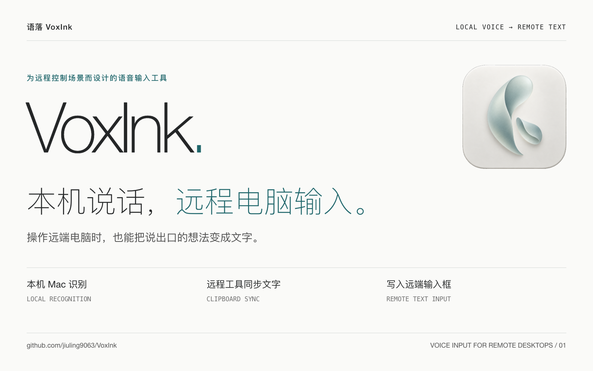
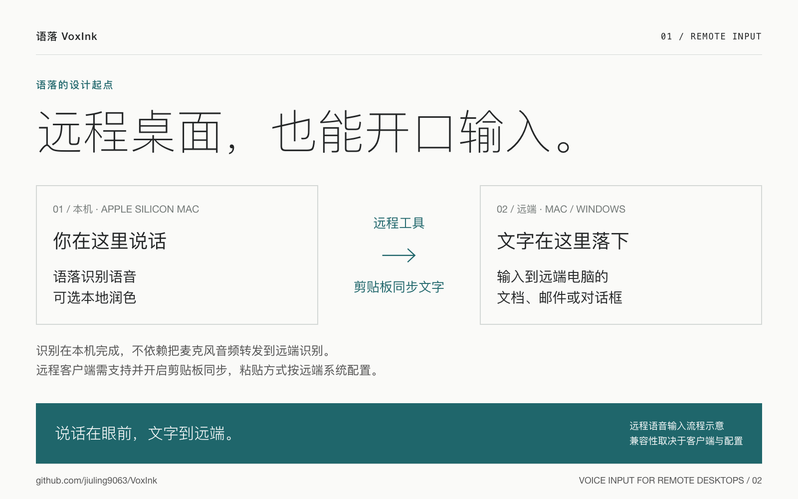
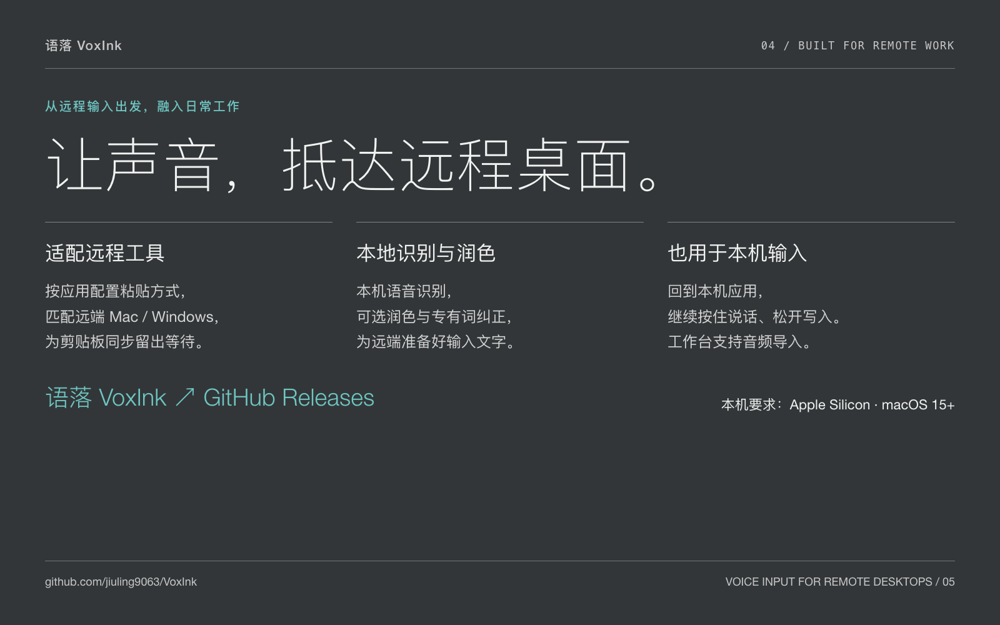
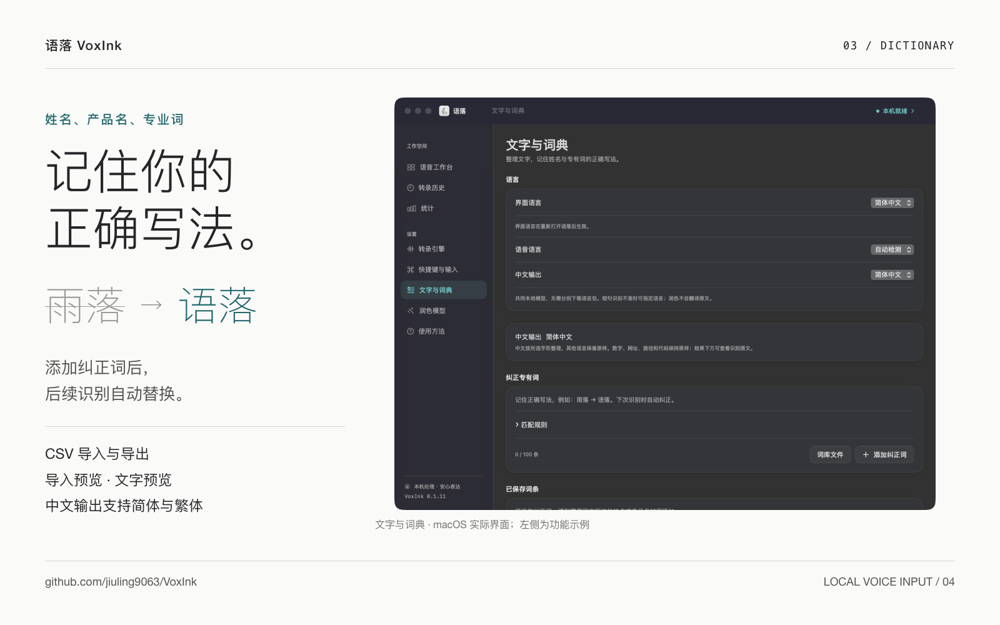
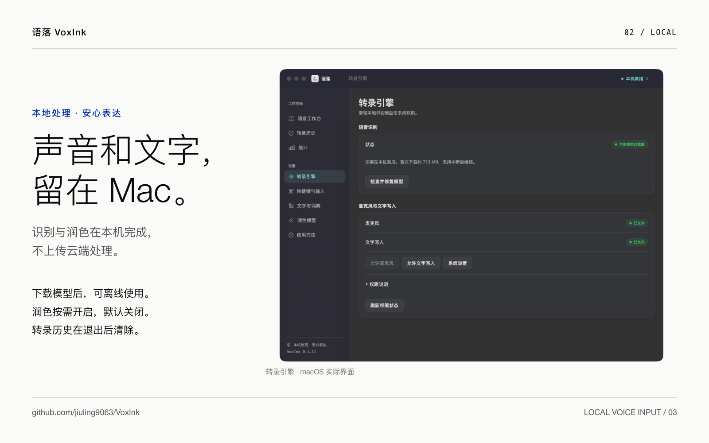

<p align="center">
  
</p>
<h1 align="center">语落 VoxInk</h1>
<p align="center">本机说话，远程电脑输入。为远程控制场景而设计的语音输入工具。</p>
<p align="center">
  <a href="https://github.com/jiuling9063/VoxInk/releases/latest">下载正式版</a> ·
  <a href="#60-秒了解语落">观看宣传片</a> ·
  <a href="docs/安装与使用.md">安装与使用</a> ·
  <a href="CHANGELOG.md">更新记录</a> ·
  <a href="https://github.com/jiuling9063/VoxInk/issues">问题反馈</a>
</p>

**远程控制电脑时，也能用语音输入文字——这是语落 VoxInk 的设计起点与核心场景。** 在本机 Apple Silicon Mac 上说话，语落完成识别和可选润色，再借助远程工具的剪贴板同步，将文字输入远端电脑的目标输入框。语落也支持本机应用中的日常语音输入。

运行组件已随 App 提供，首次使用只需授权和下载模型，无需自行安装 Python、MLX 或配置命令行环境。

当前正式版本：**0.1.13（构建 15）**，通过签名、公证的 DMG 直接分发。源码和正式安装包通过本仓库公开提供。

## 60 秒了解语落

https://github.com/user-attachments/assets/45cf0fa3-303b-4480-aefd-215ef05ab800

中文 · 60 秒 · 1080p

从本机 Mac 开口，到远程 Windows / Mac 输入框落字，了解语落的核心使用场景。视频中的远程操作为流程示意，具体配置和兼容性以[安装与使用](docs/安装与使用.md#远程工具)为准。

## 为远程输入而设计

操作的是远端电脑，说话用的是本机麦克风。语落在本机完成语音识别，不依赖把麦克风音频转发给远端识别；识别后的文字通过远程客户端的剪贴板同步传递，再发送适合远端系统的粘贴快捷键。



在“快捷键与输入 → 远程工具”中按应用选择 Mac / Windows 粘贴方式，并设置剪贴板同步等待。远程客户端必须支持并启用剪贴板同步；具体配置见[安装与使用](docs/安装与使用.md#远程工具)。不同客户端、远端系统和全屏模式的兼容性存在差异；网页远程桌面请手动复制。

## 功能



| 功能 | 说明 |
| --- | --- |
| 首次输入引导 | 按本机或远程场景完成权限、模型、远程配置、固定文字和语音输入验证；支持稍后继续 |
| **远程电脑语音输入** | **核心场景：本机识别，经远程工具剪贴板同步写入远端；按应用配置 Mac / Windows 粘贴方式和同步等待** |
| 快捷语音输入 | 默认 `⌥ Space`，支持推荐组合、自定义快捷键、按住说话或切换录音 |
| 本地识别 | 音频在 Mac 上处理，模型下载后可离线使用 |
| 可选本地润色 | 整理口头词和明显重复；失败、超时或校验不通过时保留未润色文字 |
| 自定义词库 | 专有名词纠正、CSV 导入预览与导出、文字预览 |
| 多语言 | 简体中文、繁体中文、英语、日语、韩语界面；普通话、粤语、英语、日语、韩语识别及自动检测 |
| 工作台与恢复 | 录音试用、音频导入、复制结果、本次启动期间的转录历史；未完成录音可恢复 |

### 词库与文字处理

为姓名、产品名和专业词添加固定写法，后续识别时自动纠正。支持 CSV 导入预览与导出，可先通过文字预览检查替换结果。



<sub>实际界面截图来自 0.1.11；“雨落 → 语落”为功能示例，截图中尚未添加词条。</sub>

## 系统要求

- Apple Silicon Mac（M 系列），macOS 15+；当前安装包不支持 Intel Mac。
- 首次下载模型需要网络，后续识别与润色可离线运行。
- 识别模型约 **713 MB**；润色可选，下载量约 **1–8.3 GB**。请另留安装与缓存空间，模型文件大小不等于运行内存。
- 高档润色模型需要更多内存；“最佳效果”档建议 24 GB 及以上内存。速度与质量取决于设备、输入长度和语言。

## 安装与开始使用

1. 从 [Releases](https://github.com/jiuling9063/VoxInk/releases/latest) 下载 `VoxInk-0.1.13-macOS-arm64.dmg`。
2. 打开安装盘，将 **VoxInk** 拖入 **应用程序**；更新前先退出旧版。
3. 打开 App，按首次引导选择本机或远程输入，允许麦克风和文字写入权限，下载识别模型。
4. 远程输入需添加远程工具，确认远端系统对应的粘贴方式及剪贴板同步。
5. 按引导完成固定文字与语音测试，亲自确认目标输入框收到正确文字后开始使用。默认按住 `⌥ Space` 说话，松开写入；`Esc` 取消。

工作台录音与音频导入只展示结果，方便检查和手动复制。润色默认关闭，可在“润色模型”下载所需模型并开启。更新会沿用本机模型、词库和偏好。

将发布页的 `SHA256SUMS.txt` 与 DMG 放在同一目录，可选运行 `shasum -a 256 -c SHA256SUMS.txt` 核对文件完整性。更多步骤见 [安装与使用](docs/安装与使用.md)。

## 本地处理与隐私



<sub>转录引擎实际界面截图来自 0.1.11。当前功能与数据处理方式以下方说明为准。</sub>

- 音频与文字不上传云端识别或润色，也不会自动切换到云端模型。
- 远程输入时，识别后的文字会经远程客户端的剪贴板同步传递到远端电脑；本地识别不代表文字始终留在本机。同步行为与安全性也取决于所用远程工具及其配置。
- 模型从 Hugging Face 按固定版本下载；下载服务会接收正常网络连接信息。来源和校验数据见 [识别模型清单](benchmark/model-manifest.json) 与 [润色模型定义](app/Sources/VoxInkUI/PolishModel.swift)。
- 转录历史在退出后清除。当前结果可查看识别原文，历史目前只保存最终文字。
- 完成写入、成功复制或取消后清理对应录音。未完成录音最多一条，有效期 24 小时，App 运行时检查清理；退出期间没有后台进程到点删除。
- 词库、偏好及不含原文的性能统计保存在本机。写入会临时使用系统剪贴板；只有剪贴板仍归本次操作所有时才恢复原内容。
- 模型权重、私人录音和本机缓存不提交到仓库。反馈请使用无隐私示例。

## 已知限制

- 识别和润色可能出错，尤其是短句语言检测、日语同音词、姓名、口音和混合语言。重要内容仍需核对。
- “已发送粘贴”表示按键已发出，不代表目标应用确认收到文字。录音到写入期间请保持同一输入位置；同一应用内切换标签、聊天或远程会话不能全部检测。
- 输入框查询超时或失败时停止自动写入并保留结果；部分应用不提供标准辅助功能字段，兼容路径无法判断其内部是否为密码框，请勿用于安全输入。
- 远程客户端需支持剪贴板同步；默认等待 2 秒，不保证所有客户端、远端系统和全屏模式均兼容。
- 本轮 UU 远端 Mac 的文字和语音输入通过，但额外语音浮窗仍会出现；添加“仅控制端响应”规则后仍复现，原因待查。遇到此情况先取消额外录音并检查两端快捷键冲突。
- 首次引导可能残留上一阶段的权限提示；部分系统将辅助功能页称为“设备控制和数据访问”。远程工具若默认同步且没有独立开关，可先核实跨电脑复制粘贴正常，再确认同步步骤。
- 冷启动、切换语言和闲置释放后的首次输入仍有加载开销。润色下载目前只有阶段信息，尚无完整字节进度。
- 历史原文对照与清理、词库搜索和删除撤销尚待完善；闲置释放后的预热提示可能滞后。
- 尚未完成所有机型、干净系统首次安装和长期设备切换测试。当前版本直接分发，未在 Mac App Store 发布。

改进依据见 [项目复盘](docs/项目复盘-2026-09-26.md)，本版检查见 [发布验证](docs/发布验证-0.1.13.md)。

## 从源码构建

以下仅针对开发者。需要 Xcode（含 macOS SDK、Swift 6）、Python 3、`uv` 和构建依赖的网络访问。完整应用包含 Swift 识别组件及内置 Python 润色运行时。

`xcode-select -p` 应指向完整 Xcode 的 Developer 目录；如果显示 `CommandLineTools`，请将下面的 `DEVELOPER_DIR` 改为实际安装的 Xcode 内 `Contents/Developer` 路径。

```sh
git clone https://github.com/jiuling9063/VoxInk.git
cd VoxInk
# 按实际 Xcode 安装位置选择开发工具
export DEVELOPER_DIR="$(xcode-select -p)"
./script/build_and_run.sh --build-only
```

结果入口为 `dist/VoxInk.app`，实际开发包位于用户缓存目录。默认临时签名仅供本机开发，对外发布需维护者的 Developer ID 证书与公证流程。

```sh
# 独立临时构建目录可避免同步目录附加资源属性
VOXINK_UI_LANGUAGE=zh-Hans swift test --package-path app \
  --scratch-path /tmp/voxink-app-xcode-beta --no-parallel
python3 -m unittest discover -s script/tests
python3 script/check_localizations.py
```

下载和真实模型测试单独运行，会下载模型或占用较多资源。更多约定见 [贡献指南](CONTRIBUTING.md)。

## 项目结构

```text
app/
  Sources/VoxInkApp/     App 入口、菜单与生命周期
  Sources/VoxInkUI/      SwiftUI 界面和工作流
  Sources/VoxInkCore/    写入、模型安装、词库与本地化
  Tests/                Swift 回归测试
script/                 构建、打包、润色 Worker 与验证脚本
benchmark/              识别组件、模型清单和性能实验
docs/                   使用说明、设计与发布验证
plans/                  阶段性方案与历史计划
```

历史文档反映当时阶段；当前使用方式以本 README、安装说明和最新版本记录为准。

## 反馈与贡献

提交 [Issue](https://github.com/jiuling9063/VoxInk/issues) 时请附版本、Mac 芯片与内存、macOS 版本、目标应用、复现步骤和预期结果。远程问题请同时说明客户端与远端系统。不要提交私人聊天、录音、密码或令牌。

代码变更请保持小范围，说明行为变化和验证结果，详见 [CONTRIBUTING.md](CONTRIBUTING.md)。

## 授权与致谢

仓库尚未指定项目级开源许可证；源码可访问不代表已授予开源再分发授权。对外再分发或商业授权请先与维护者确认。

感谢 Qwen、MLX、speech-swift、OpenCCSwift 等上游项目。第三方组件和模型适用各自许可，声明见 [ThirdPartyNotices](app/ThirdPartyNotices.txt)；随包运行时与下载模型保留各自许可文件。
