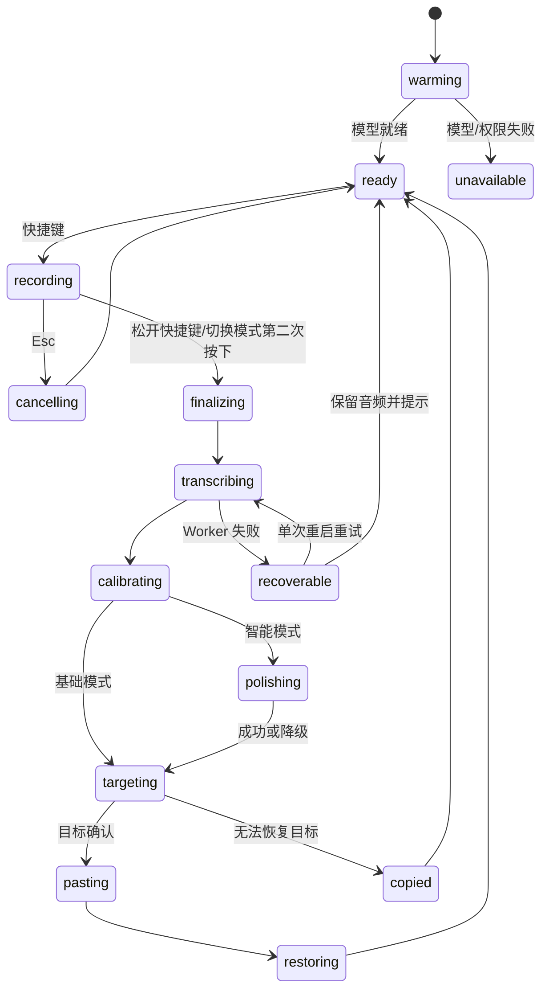

# 语落 VoxInk 技术架构方案 v1.1

- 日期：2026-09-08
- 目标设备：M5 MacBook Air，16GB 内存，512GB 存储
- 目标系统：macOS 15 及以上，Apple Silicon
- 核心场景：MacBook 本地语音识别，通过网易 UU 向远程 Mac mini 当前输入框粘贴文字
- 架构目标：准确、低时延、稳定简体、可选润色、失败时不丢文字

## 1. 最终建议

VoxInk 采用 **原生 Swift App + 本地推理 Worker + 分层文字处理 + 单次可靠粘贴** 的架构。

首版最终形态：

```text
VoxInk.app
├── App Core：快捷键、状态机、录音、焦点、剪贴板、浮层
├── ASR Worker：常驻本地语音模型，负责识别与质量信号
├── Deterministic Text Pipeline：原文保护、简体、词典、空格、标点
└── Polish Worker：按需加载本地小模型，超时或异常立即降级
```

语音模型不凭项目热度或主观印象决定。先用用户自己的录音对以下候选做同机盲测：

1. Qwen3-ASR 0.6B 4-bit MLX；
2. WhisperKit Large V3 Turbo；
3. WhisperKit Medium，作为准确率与稳定性基线。

发布版只内置一套 ASR 引擎并只推荐一个模型。根据当前证据，**Qwen3-ASR 作为首个测试候选，WhisperKit Turbo 作为强对照**。Qwen3-ASR 模型约 675MB、常驻约 2.1GB，原生 Swift/MLX 路线已经有公开实现；WhisperKit Turbo 已在用户当前设备上主观验证速度较好。正式 100 条盲测和 ADR 完成前，任何接入模型都只用于临时验证；通过统一硬门槛后，再依据实际指标差异和稳定性选择正式默认值。

## 2. 第一性原理

### 2.1 准确率的来源

最终文字准确率由四类信息决定：

1. 麦克风是否收到了清晰、完整的声音；
2. ASR 是否把声音正确解码为文字；
3. 专有名词、数字和中英混说是否得到正确约束；
4. 后处理是否保留原意，没有“越改越错”。

LLM 只能根据已有文字猜测上下文，无法恢复 ASR 已经漏掉的声音。因此“校准”必须优先依靠音频完整性、ASR 模型、语言提示、置信信号和专有词典；LLM 只负责可选的书面化处理。

### 2.2 时延的来源

停止说话后的等待时间约等于：

```text
尾部音频确认
+ ASR 剩余计算
+ 确定性文字处理
+ 可选 LLM 润色
+ 恢复目标焦点并粘贴
```

降低时延的关键不是让每一层都异步，而是：

- 模型提前加载并保持热状态；
- 基础版把最长 60 秒的完整录音在停止后做一次整段识别；
- 流式预览与长句分块留到核心闭环稳定后验证，且不得放宽已有性能目标；
- 简体、词典和标点使用毫秒级确定性代码；
- LLM 有独立预算，绝不能阻断基础输入。

### 2.3 稳定性的来源

语音输入是一次事务。每次快捷键触发产生唯一 `sessionID`，整个流程只允许一个活动会话。任何过期回调、重复按键或 Worker 晚到的结果都必须因为 `sessionID` 不匹配而丢弃。

粘贴采用“最多一次”策略。系统无法可靠确认远程 UU 输入框是否已收到文字，因此不能自动重试 `Command + V`，否则可能重复输入。失败时保留结果，由用户执行“重新粘贴”。

## 3. 总体架构

```mermaid
flowchart LR
    HK[全局快捷键] --> SM[会话状态机]
    SM --> FG[记录目标 App/PID]
    SM --> AC[AVAudioEngine 录音]
    AC --> AQ[最长 60 秒 16kHz Mono PCM]
    AQ --> ASR[停止后整段 ASR Worker]
    ASR --> QG[质量门]
    QG -->|正常| PI[提取保护项并保留原文]
    QG -->|低置信| RD[单次受限重解码]
    RD --> PI
    PI --> OC[OpenCC 大陆简体]
    OC --> DI[专有词典与规则]
    DI --> RF{智能润色开启?}
    RF -->|否| FP[最终校验]
    RF -->|是| LLM[Polish Worker]
    LLM --> SG[语义护栏]
    SG -->|通过| FP
    SG -->|失败/超时| FP
    FP --> FC[恢复目标焦点]
    FC --> PB[暂存剪贴板并写入文字]
    PB --> PV[发送一次 Command+V]
    PV --> PR[条件式恢复剪贴板]
```



## 4. 进程与模块边界

### 4.1 VoxInk App Core

使用 Swift 6、AppKit 和少量 SwiftUI。它负责：

- 菜单栏和非激活浮层；
- `Option + Space` 全局快捷键：默认按住录音、松开结束；可切换并保存按两次模式，按键释放需独立去重；
- 麦克风录音和设备变化处理；
- 串行会话状态机；
- 保存与恢复目标 App；
- 剪贴板事务和 `Command + V`；
- 权限、模型状态和错误提示。

App Core 不运行大模型推理，避免推理崩溃或内存异常直接带走快捷键与界面。

### 4.2 ASR Worker

采用随 App 签名的本地 XPC Service，保持一个模型实例常驻。它负责：

- 加载、预热和卸载 ASR 模型；
- 接收带采样率元数据的完整 PCM；
- 基础版对最长 60 秒音频做整段识别；
- 根据实际引擎依赖能力显式适配输入采样率、取消和结果格式；
- 返回文字、识别语言、耗时及可用的质量信号；
- 无响应时被主 App 终止并重建。

麦克风始终由 App Core 捕获，ASR Worker 不申请麦克风权限。PCM 数据量约 64KB/秒，XPC 传输成本相对模型推理可以忽略。

### 4.3 Polish Worker

采用独立、按需启动的本地 Worker。正式版优先使用内嵌 `llama.cpp` 运行时和经基准选出的 1.5B–4B 指令模型 Q4 量化版；开发期可保留 Ollama Adapter 做模型比较。

独立 Worker 的作用：

- 润色崩溃不影响基础语音输入；
- 超时后可立即取消或重启；
- 用户关闭智能润色后可以彻底释放 LLM 内存；
- 正式使用不要求用户额外安装 Ollama。

Apple Foundation Models 可作为 macOS 26 且 Apple Intelligence 可用时的可选实现，但不能作为基础依赖，因为系统版本、语言能力和可用状态不统一。

## 5. 音频链路

### 5.1 捕获

- 使用 `AVAudioEngine` 捕获系统默认麦克风；
- 转为单声道 Float32；
- 统一重采样到 16kHz；
- 音频回调只复制缓冲区，不执行识别、文件写入或 UI 操作；
- 使用有界队列送往后台任务，避免阻塞实时音频线程；
- 监测 RMS、削波比例、实际采样时长和设备中断。

### 5.2 完整性

录音期间增量写入权限为 `0600` 的临时 PCM/WAV 文件，同时保留短环形内存缓冲。这样可以：

- 避免长录音无限占用内存；
- Worker 崩溃后重新识别同一段音频；
- App 异常退出后提示恢复未完成录音。

16kHz 单声道 PCM/WAV 是产品和正式基准的 canonical corpus。Qwen smoke 修订前曾以 24kHz 调用模型，该旧实现不能作为引擎要求；按固定上游源码核实默认值后，CLI 已改用 16kHz。任何 Adapter 如需偏离 canonical 采样率，仍必须显式记录重采样耗时与产物参数。

音频寿命只由本地事件决定：取消会话立即删除；成功识别后，在粘贴已发出且剪贴板清理完成，或“只复制”结果已安全写入后删除；ASR、音频或 XPC 失败时保留供重试。保留音频最长 24 小时，App 启动时及运行期间定期清理超期孤立文件。远端是否收到不可确认，也不参与保留或删除判断。该目录不构成历史记录，不参与同步，也不写入备份。

### 5.3 整段语音检测与后置分块

2026-09-09 已复现纯噪声被 ASR 误识别，因此基础原型增加系统 SoundAnalysis 整段语音检测。任一 0.5 秒窗口中 speech / whispering 置信度达到 0.5 才进入 ASR；窗口重叠 50%，仅分类器补齐尾窗，原文件保持完整。检测没有清晰语音时不自动写入，保留音频供重试或删除；分析失败明确报错，不作为静音处理。数字全零检查仍先行。

该门槛只完成本机 18 个开发用例验证，真实弱语音、环境噪声和其他受支持系统仍待验收。它不裁剪音频，也不因为分类结果不可逆丢弃用户录音。长句分块继续后置，届时再评估 Silero VAD 或所选引擎的 VAD 并验证首尾不丢失。实现与限制见 [语音活动检测与噪声回归](docs/语音活动检测与噪声回归-2026-09-09.md)。

不使用激进降噪和自动增益作为默认处理，因为它们可能破坏辅音、数字和中英混说。只有检测到输入电平明显异常时提示用户调整麦克风。

## 6. 基础版识别策略与后置优化

### 6.1 基础版整段路径

```text
录音完成或达到 60 秒自动停止 → 完整音频由热模型整段识别一次 → 质量门
```

基础版只保留这一条路径，录音中不显示临时文字，也不做分块识别。完整上下文可减少拼接、重复和尾段遗漏变量。

### 6.2 后置的长句路径

核心闭环稳定后才评估流式预览和长句分块：

- 目标块长 12–20 秒；
- 优先在 VAD 静音边界切分；
- 无停顿时强制切块并保留约 0.5–1 秒重叠；
- 已确认块在用户说话时后台识别；
- 停止时只识别尚未确认的尾段；
- 用时间和重叠文本消除重复，不重新跑整段音频。

阈值、块长和重叠量必须用真实语料调整，不能写死后不测；上线条件还包括不得降低第 12 节基础性能目标与准确率门槛。

### 6.3 语言策略

VoxInk 首要模式固定为“简体中文”：

- 主语言明确传 `zh`；
- 任务固定为 transcription，禁止翻译；
- 允许模型保留英文、数字、路径和代码词；
- 只有用户以后明确开启多语言自动模式时才使用自动检测。

固定 `zh` 可避免 Listen K 界面显示中文、底层却使用 `auto` 的不一致，也减少短语音误判语言。

### 6.4 专有词与上下文偏置

用户词典同时作用于两个位置：

1. ASR 引擎支持 prompt/hotwords 时，向解码器提供有限长度的候选词；
2. 识别后执行带边界的确定性替换。

词典必须限制总 token 数，避免提示过长降低识别质量。默认只放用户确认过的姓名、产品、公司、缩写和常用英文术语。

2026-09-09 原型进度：识别后边界替换、本地原子持久化、设置 CRUD/预览及会话规则快照已接入，原始识别结果只读保留。上限 100 条、4096 字符及 16384 UTF-8 字节，数字必须保持原写法；这些存储预算不等同于模型 token 预算。ASR 热词上下文尚未接入，需结合真实音频验证后启用。详见 [用户词典验证](docs/用户词典验证-2026-09-09.md)。

后续实测：新增显式批量实验和固定分词器 256 token 预算，但当前 Qwen 候选在静音与合成噪声下会回显词表，未通过无语音安全门，产品常驻模式禁用该实验。有限候选提示仍是待实现的产品要求，不能把接口存在视为能力验收；需结合可靠语音活动检测或其他引擎方案重新验证。当前无提示产品也已复现低音量噪声误识别，不能只依赖数字全零过滤。证据见 [ASR 热词提示对照](docs/ASR热词提示对照-2026-09-09.md)。

### 6.5 质量门与受限重试

质量门读取引擎可提供的信号：

- 平均 log probability；
- no-speech probability；
- 压缩率或重复片段；
- 音频时长与文字长度是否严重不匹配；
- 有效语音存在但结果为空；
- 中文模式下结果异常地完全没有中文或英文。

只有低置信片段允许再解码一次，重试仍使用同一已加载模型，通过固定 `zh`、自定义词或更保守参数纠正。不得同时常驻两个 ASR 模型，也不得每次都双模型投票，因为这会直接翻倍内存和时延。

## 7. ASR 模型选择

| 候选 | 优势 | 风险 | 结论 |
| --- | --- | --- | --- |
| Qwen3-ASR 0.6B 4-bit MLX | 约 675MB；公开原生 Swift 实现；中英日和混说；常驻约 2.1GB | 4-bit 量化损失和用户普通话准确率尚未实测；质量信号能力需核对 | 第一测试候选 |
| WhisperKit Large V3 Turbo | 用户已感知较快；WhisperKit 生态成熟；多语言能力强 | 模型和内存更大；中文可能输出繁体；流式尾段需谨慎处理 | 强对照候选 |
| WhisperKit Medium | OpenQuack 有 M4/16GB 基准和稳定实现 | 通常比 Turbo 慢；模型优势是否适用于中文未知 | 基准候选 |
| Apple Speech | 系统集成简单 | 行为受系统设置和语言包影响，稳定性与可控性不足 | 仅作应急备选，不作主引擎 |
| Parakeet | 英文速度和准确率强 | 中文支持不符合核心需求 | 排除 |

发布选择规则：三套候选先通过统一硬门槛，再根据实测准确率、三种时延、稳定性、资源和集成复杂度的实际差异作出 ADR。本版不计算综合分。

## 8. 确定性文字处理

处理顺序固定为：

```text
ASR 原文（只读保留）
→ 从原文提取数字、金额、日期、时间、版本号、URL、邮箱、路径和代码标识符，并按原文片段隔离保护
→ Unicode/控制字符/异常空格规范化
→ 第一次 OpenCC 转大陆简体
→ 用户词典校正
→ 标点与中英文空格整理
→ 可选 LLM 润色
→ 语义护栏
→ 第二次 OpenCC 转简体
→ 恢复保护项并做最终格式检查
```

### 8.1 简体转换

采用 [OpenCCSwift](https://github.com/doggy8088/opencc-swift) 进程内转换：

- MIT 许可；
- 纯 Swift，无需启动外部 `opencc` 命令；
- 内嵌字典约 1.1MB；
- 支持 Trie 最长匹配和词级转换；
- 可将“軟體平台”转换为“软件平台”，优于 ICU 仅做字符转换得到“软体平台”。

转换器在 App 启动时构造一次并复用。用同时覆盖字符与词组差异的固定输入/期望输出样例，逐个验证 OpenCCSwift 实际可用配置后锁定唯一配置；未经样例验证不得预设 `t2s`，也不得与 Swift `Locale` 转换混用。LLM 后再执行同一 OpenCC 配置，防止模型重新输出繁体。只有 OpenCC 失败时才允许 ICU `Hant → Hans` 作为字符级降级，并明确它不保证“軟體→软件”等大陆词汇转换。

### 8.2 规则校准

规则必须保守：

- 去首尾空白和不可见控制字符；
- 合并异常空格；
- 处理中英文与数字之间的空格；
- 清理明显的连续重复标点；
- 根据 ASR 标点和长停顿补齐句末标点；
- 只删除独立且高置信的语气填充词。

“就是”“这个”“然后”等词可能承载含义，不允许用简单正则全局删除。

2026-09-09 原型实现：原文保护采用直接保留片段，避免占位符碰撞；空白/控制字符、受限标点和句首“呃”规则已接入，并保留只读原文对照。固定 `twp → cn` 配置对已是大陆用语的“文件”增加稳定保护，避免二次转换漂移。用户词典现已在 OpenCC 后、标点规则前接入；基于真实停顿的句末补标点尚未接入，不能将固定文字样例通过等同于口语原意验收。基础规则见 [文字规则与界面验证](docs/文字规则与界面验证-2026-09-09.md)，词典新增保护与证据见 [用户词典验证](docs/用户词典验证-2026-09-09.md)。

### 8.3 数字

数字、金额、日期、时间、版本号、URL、邮箱和代码标识符属于高风险信息。第一版默认保留 ASR 输出，不做激进的中文数字转阿拉伯数字。以后增加 ITN 时，只对有明确语法的时间、百分比和金额执行，并配套单元测试。

## 9. 智能润色

### 9.1 能做什么

- 增加和修正标点；
- 合并口头重复；
- 根据最终改口整理句子；
- 把明确列举内容整理为列表；
- 做轻微语病修正；
- 保持中英混说、语气、事实和信息量。

### 9.2 不能做什么

- 猜测缺失的音频内容；
- 总结、扩写或添加事实；
- 改写姓名、数字、URL、路径和代码；
- 翻译；
- 因为模型不可用而阻止粘贴。

### 9.3 推理策略

- 温度接近 0；
- 输出 token 上限按输入长度动态限制；
- 只输出润色后的文本；
- 智能模式开启时预热模型；
- 目标新增时延中位数不超过 1.2 秒；
- 2.5 秒硬超时，超时立即使用确定性结果；
- 取消后丢弃迟到输出。

候选模型应以中文编辑测试集比较 1.5B、3B/4B 的 Q4 量化模型。8B 模型不作为 16GB MacBook Air 默认项，因为它与 ASR 同时常驻会增加内存压力、热量和尾部时延。

### 9.4 语义护栏

LLM 输出满足以下条件才可使用：

- 非空；
- 输入中的数字、金额、URL、邮箱和代码保护项完整保留；
- 没有新增保护项；
- 长度比例处于可接受区间；
- 没有出现说明文字、引号包裹或 Markdown 围栏；
- 语言仍为原语言；
- 最终 OpenCC 转换成功。

任何一项失败都回退到 LLM 前的确定性结果。护栏只决定“是否采用润色”，不弹阻塞式错误。

## 10. 焦点与粘贴事务

### 10.1 目标记录

开始录音时保存：

- 前台 `NSRunningApplication` 的 PID；
- Bundle ID；
- 激活状态；
- 会话 ID。

浮层使用 `.nonactivatingPanel`，避免主动抢焦点。粘贴前若目标 App 仍在前台则直接继续；否则按 PID/Bundle ID 激活并轮询确认，P95 目标不超过 600ms。

### 10.2 剪贴板事务

剪贴板快照应在即将粘贴时获取，而不是录音开始时获取，这样可以保留用户录音期间主动复制的新内容。

步骤：

1. 记录快照前 `changeCount`；
2. 复制全部 `NSPasteboardItem`、每个类型及其独立 `Data` 副本；
3. 记录快照后 `changeCount`；若与快照前不一致或任一数据读取失败，则放弃本次写入并保留文字供手动重试；
4. 写入最终纯文本并记录 VoxInk 写入后的 `changeCount`；
5. 等待目标 App 和 UU 读取剪贴板并发送一次 `Command + V`；
6. 延迟恢复窗口先使用 1.0–1.5 秒候选值，按真实 UU 测试锁定；
7. 只有当前 `changeCount` 仍等于 VoxInk 写入值时才恢复完整快照；恢复作为带唯一 `pasteTransactionID` 的幂等清理执行。

如果用户在任何快照或延迟阶段复制了新内容，VoxInk 不恢复旧快照，避免覆盖用户操作。快照失败、写入失败或恢复失败都不得用部分数据覆盖剪贴板。快速连续输入时，每次会话与粘贴事务分别编号；旧事务只能清理自己仍持有的写入版本，不能恢复到新事务之上。

### 10.3 远程限制

本地 macOS 只能看到网易 UU 这个前台 App，无法识别远程 Mac mini 内部是否是密码框，也无法可靠读取远程输入框内容验证粘贴结果。因此：

- 每次只发送一次粘贴；
- 不自动重试；
- 显示“已发送”，不声称“远端已确认”；
- 最后结果保留在内存中，支持手动重新粘贴；
- 用户在远程密码框中需自行避免触发语音输入。

“已发送”只表示本机已发出一次粘贴按键。所有取消在该按键发出前都可终止后续粘贴；按键发出后取消不得再宣称撤回，但仍必须完成本地剪贴板清理。该清理与音频寿命事件不等待远端确认。

## 11. 会话状态机



状态机由一个 Swift `actor` 独占。所有异步操作携带 `sessionID` 和取消令牌。开始、停止、取消、Worker 回调、睡眠唤醒和 App 退出都通过状态机处理，禁止多个模块直接修改录音状态。

取消边界以“是否已发出粘贴按键”为准：发出前的录音、ASR、XPC、文字处理、目标恢复及粘贴等待阶段均可取消并回到 `ready`；发出后仍进入 `restoring` 完成本地清理。ASR、音频或 XPC 失败也必须离开处理中状态，进入可重试或就绪状态，不能无限停留。

## 12. 性能预算

基础模式以 10 秒普通话、模型热启动为基线：

| 环节 | 中位目标 | P95 目标 |
| --- | ---: | ---: |
| 快捷键反馈 | 50ms | 150ms |
| 停止后 ASR | 800ms | 1,800ms |
| OpenCC + 规则 + 词典 | 20ms | 50ms |
| 目标恢复与发出粘贴 | 200ms | 600ms |
| 停止到文字发出 | 1.2s | 2.5s |

智能模式单独计算：

| 环节 | 中位目标 | 上限 |
| --- | ---: | ---: |
| LLM 润色新增时延 | 1.2s | 2.5s 强制硬超时 |
| 停止到文字发出 | 2.5s | 5.0s，超时走基础结果 |

资源目标：

| 模式 | 内存目标 | 磁盘目标 |
| --- | ---: | ---: |
| 基础模式 | 活跃峰值不超过 3GB | App + ASR 不超过 1GB |
| 智能模式 | 活跃峰值不超过 6GB | App + ASR + LLM 不超过 3GB |
| 空闲但 ASR 热加载 | CPU 接近 0% | 不持续占用 GPU |

## 13. 故障策略

| 故障 | 行为 |
| --- | --- |
| 麦克风权限缺失 | 不开始录音，打开对应系统设置 |
| 音频设备中途变化 | 安全结束当前录音，用已捕获音频继续识别 |
| 没有有效语音 | 不修改剪贴板，提示未检测到语音 |
| ASR Worker 崩溃或失联 | 结束当前调用并离开处理中状态；保留临时音频，重建 Worker 后仅允许用户发起或策略明确的一次重试 |
| ASR 第二次失败 | 保留临时音频，提示重新识别，不粘贴空文本 |
| OpenCC 失败 | 使用系统 ICU 的 `Hant → Hans` 字符级转换后继续，并标记仅完成字符级降级；两种转换都失败时保留原文并明确提示 |
| LLM 未就绪、空结果、越界或超时 | 静默回退确定性结果并继续粘贴 |
| 目标 App 已退出或无法激活 | 只复制结果并提示 |
| 辅助功能权限缺失 | 只复制结果并提供设置入口 |
| 剪贴板在等待期间被用户修改 | 不恢复旧快照 |
| 睡眠/唤醒 | 取消活动会话，重建音频和快捷键监听，检查 Worker 健康 |

## 14. 关键架构决策

### ADR-001：原生 Swift，不使用 Electron/Tauri

- 决策：AppKit/SwiftUI + Swift Concurrency。
- 原因：目标只有 macOS；可降低包体、权限、内存和焦点问题。
- 代价：不复用跨平台 UI，需维护 macOS 原生代码。

### ADR-002：模型推理放在本地 Worker

- 决策：App 捕获音频；每个候选必须实际打包到最小独立进程，完成模型加载、输入/输出序列化、取消、进程断连、主进程检测、Worker 重启和模型格式试验，再锁定 ASR/LLM Worker 的 XPC 协议。仅通过进程内调用不足以定案，目标形态是在签名 Worker 中运行。
- 原因：崩溃隔离、超时终止、可独立释放模型内存。
- 代价：增加 XPC 协议、签名和生命周期管理。

### ADR-003：基础版最长 60 秒整段识别，分块后置

- 决策：基础版停止后对最长 60 秒完整音频只识别一次；流式预览与长句分块另行试验后决定。
- 原因：先减少拼接、重复、尾段和取消语义的变量，验证可靠闭环。
- 代价：长录音停止后时延可能更高，但性能目标保持不变；后置分块需补重叠去重和阈值基准。

### ADR-004：确定性处理是主链路，LLM 是旁路增强

- 决策：OpenCC、词典和格式规则永远可用；LLM 可关闭、可超时、可失败。
- 原因：润色不能成为输入成功的前提。
- 代价：基础模式不会主动重写复杂口语。

### ADR-005：粘贴采用最多一次

- 决策：不自动重试远程粘贴。
- 原因：网易 UU 缺少可读的端到端确认，重试会产生重复文字。
- 代价：极少数漏粘贴需要用户点击“重新粘贴”。

### ADR-006：发布版只保留一个默认 ASR 模型

- 决策：内部保留引擎协议，产品界面不提供模型商城。
- 原因：减少配置、下载、磁盘和测试组合。
- 代价：更换模型需要发布新版本或受控实验开关。

## 15. 模型与整体体验基准

### 15.1 语料

至少录制 100 条冻结验收语料，每段音频只录一次，所有候选模型读取同一文件。另设调参与 Adapter 开发集，不计入正式得分：

- 40 条普通中文短句；
- 15 条中英混说；
- 15 条姓名、公司、产品和专业术语；
- 10 条数字、金额、日期、时间和版本号；
- 10 条带改口、重复和填充词的自然口语；
- 5 条列表或步骤；
- 5 条 30–60 秒长语音；
- 安静与普通办公室噪声各一版关键样本。

验收语料另按短、中、长时长组报告，并提前冻结至少 30 条 9–11 秒固定子集，专门计算“10 秒语音”P50/P95。多轮重复用于观察同一样本的波动，统计时保留 `sample_id` 层级，不把 30 条音频的 3 轮运行宣称为 90 个独立样本。

### 15.2 指标与硬门槛

| 指标 | 门槛 |
| --- | --- |
| 中文 CER | 清晰语音不高于 8% |
| 姓名/术语准确率 | 不低于 95%，允许用户词典辅助 |
| 数字与保护项完整率 | 100% 才允许智能润色上线 |
| 10 秒语音 ASR P50/P95 | ≤0.8s / ≤1.8s |
| 停止到本地发出粘贴 P50/P95 | ≤1.2s / ≤2.5s |
| 停止到远端文字可见 P50/P95 | 独立采集，目标 ≤1.2s / ≤2.5s；本地发出结果不得替代 |
| 50 次网易 UU 粘贴 | 至少 49 次正确，最多 1 次保留结果的可恢复失败；0 次重复、0 次错误粘贴 |
| 100 次连续识别 | 无崩溃、死锁、音频尾部丢失 |

模型参数只能使用额外开发集调整；至少 100 条冻结验收语料只运行冻结配置，不得据其结果回调参数。另设静音、纯噪声、无效/损坏音频等负样本，验证不输出幻觉文本且失败可追溯。每个候选记录加载时延、冷转录时延和热转录时延，按冷热轮和时长组分别报告。

所有候选先通过相同硬门槛。正式选型依据实际指标差异、跨轮稳定性和集成证据作出 ADR；本版不计算综合分。

### 15.3 润色基准

使用相同 ASR 原文比较小型中文指令模型：

- 原意保留；
- 断句和标点；
- 改口处理；
- 保护项完整；
- 新增时延；
- 超时率；
- 20 条原本无需修改的文本是否被过度改写。

只有人工盲评明显优于规则结果、保护项 100% 保留且 P95 不超过预算的模型才能成为内置默认润色模型。

## 16. 开发顺序

### 阶段 0：先选引擎

三套 ASR 可先各用同一批 10 条非正式小样验证下载、加载、输入、计时和汇总；固定文字 UU 粘贴验证可独立并行。随后把每个候选实际打包到独立进程，验证模型加载、协议序列化、取消、进程断连、主进程检测、Worker 重启和模型文件格式，再冻结 XPC 协议。另设开发集完成调参，最后冻结并运行至少 100 条正式验收语料。只有正式盲测与 ADR 能决定默认模型。

### 阶段 1：基础闭环

```text
快捷键 → 最长 60 秒录音 → 临时候选 ASR 整段识别 → 保护原文 → OpenCC → 词典/规则 → UU 单次粘贴 → 剪贴板恢复
```

完成 50 次真实远程粘贴和性能记录。

### 阶段 2：稳定性

加入 Worker 重启、临时音频恢复、设备切换、睡眠唤醒、权限引导和模型校验。

### 阶段 3：智能润色

比较小型 GGUF 模型，加入 Polish Worker、语义护栏和 2.5 秒硬超时。

### 阶段 4：交付

完成自己的图标、Bundle ID、MIT 版权声明、第三方许可证、Developer ID 签名、公证和 DMG。

## 17. 不采用的方案

- 不直接精简 Listen K Electron 外壳：基础体积和权限成本过高。
- 不完整 fork OpenQuack 或 Lamitype 后隐藏页面：会继承不需要的 Agent、云端、历史、字幕和设置复杂度。
- 不同时运行两个 ASR 做投票：时延和内存成本不符合目标。
- 不让 LLM 负责繁简转换、数字保护和基础断句：结果不可预测。
- 不把 8B LLM 作为 16GB 设备默认润色模型：对即时输入过重。
- 不依赖云端 API：公司远程输入涉及隐私和网络稳定性。
- 不边说边向远程输入框持续注入文字：容易产生乱序、光标跳动和重复。

## 18. 当前最佳方案一句话定义

> 使用原生 Swift 捕获最长 60 秒完整音频，停止后整段识别；以统一真实语料比较 Qwen3-ASR 0.6B MLX、WhisperKit Turbo 与 Medium 并正式选型；先保护原文中的高风险片段，再用经样例锁定的 OpenCC 配置和保守规则处理；用受语义护栏和候选超时约束的小型本地 LLM 做可选润色；最后恢复网易 UU 焦点并只发出一次粘贴，按本地事务条件恢复剪贴板。

2026-09-09 实现配置：OpenCCSwift 固定提交 `69fdd9601a7bee4485ea60847910e40744608012`，样例对比后锁定 `full twp → cn`。App 已停用会在静音时回显的简体提示，以无提示 ASR 加 OpenCC 输出简体；CLI 的提示实验仍与基线隔离。App 在调用 ASR 前检查数字静音：所有采样均为零时直接返回无有效输入，任意非零信号不被响度阈值过滤。数字全零检查之后现接入 §5.3 整段语音检测，只有通过后才调用 ASR，原音频不裁剪；有限开发用例不代表全部环境噪声验收。保护片段使用原始区间拼接，避免占位符与用户输入碰撞；识别后词典已接入；ASR 热词与可选润色仍按上文后续设计执行。
